# Architecture

> One-page system diagram and component map for Helpmefindthejob. This
> document is the "where does the code live and how does it fit
> together" reference. For the *why* — strategic context, persona
> design, cost-saving doctrine, EU AI Act compliance pack — see
> `docs/grant/`. For the MCP composition surface specifically, see
> [`docs/grant/09-mcp-composition.md`](docs/grant/09-mcp-composition.md).

Helpmefindthejob is a single-process Python application that exposes
itself in two complementary ways: a **chat-driven web UI** for direct
end-user interaction, and an **MCP (Model Context Protocol) server**
for composition with other open civic agents. The two share a single
journey state machine, persistence layer, and persona engine. The
project is licensed under Apache 2.0 with a Contributor License
Agreement; see [`LICENSE`](LICENSE) and [`cla.md`](cla.md).

## System diagram

```mermaid
flowchart TB
    %% External actors
    User([User<br/>e.g. Aïcha — Tunisian nurse, §16d Anerkennung])
    OtherAgent([Other civic agent<br/>e.g. housing agent])
    JobBoards{{Job-board APIs<br/>Adzuna · Indeed public · LinkedIn public · career pages}}
    AIProvider{{AI provider<br/>BYO: OpenAI · Anthropic · Gemini · DeepSeek · OpenRouter · Ollama · manual · Codex CLI · Claude Code · custom}}

    %% Entry surfaces
    subgraph "Entry surfaces"
        HTTPApp["Web app<br/><code>app.py</code><br/><em>HTTP, sessions, CSRF, sign-in, chat endpoint</em>"]
        MCPServer["MCP server<br/><code>mcp_server.py</code><br/><em>JSON-RPC over stdio · protocolVersion 2024-11-05</em>"]
    end

    %% Application logic
    subgraph "Application logic"
        ChatRouter["Chat router<br/><code>company_discovery/chat_router.py</code><br/><em>slash commands, intent routing, multi-turn state</em>"]
        Journey["12-phase journey state machine<br/><code>company_discovery/journey.py</code><br/><em>greet → discover → cv_check → inspire → preferences →<br/>search → review → drill → tailor → letter → cv_consult → done</em>"]
        LocaleParser["Locale-aware token parser<br/><code>company_discovery/locale_parser.py</code><br/><em>yes/no recognition, EN + DE (formal + colloquial)</em>"]
        Onboarding["Onboarding<br/><code>company_discovery/onboarding.py</code>"]
    end

    %% Domain services
    subgraph "Domain services"
        Persona["Persona engine<br/><code>company_discovery/personas.py</code><br/><code>company_discovery/persona_ranking.py</code>"]
        Aggregators["Aggregator fan-out<br/><code>company_discovery/aggregators.py</code><br/><code>company_discovery/aggregator_providers.py</code><br/><em>Adzuna, Indeed, LinkedIn, country-specific career pages</em>"]
        Discovery["Discovery providers<br/><code>company_discovery/discovery_providers.py</code><br/><code>company_discovery/service.py</code>"]
        AIProviders["AI provider abstraction<br/><code>company_discovery/ai_providers.py</code><br/><em>11 options · BYO · deterministic fallback</em>"]
        Analysis["Analysis<br/><code>company_discovery/analysis.py</code><br/><em>fit-score, tailor, motivation letter, decision brief</em>"]
        CV["CV builder<br/><code>company_discovery/cv_builder.py</code><br/><code>company_discovery/cv_consult.py</code><br/><code>company_discovery/cv_photo.py</code>"]
        SkillGap["Skill-gap atlas<br/><em>inline in analysis</em>"]
        Dedup["Dedup<br/><code>company_discovery/dedup.py</code>"]
        JobFilter["Job-type filter<br/><code>company_discovery/job_type_filter.py</code>"]
        SavedSearch["Saved-search alerts<br/><code>company_discovery/saved_search_alerts.py</code>"]
    end

    %% Persistence & crypto
    subgraph "Persistence + crypto"
        Repo["SQLite repository<br/><code>company_discovery/sqlite_repository.py</code><br/><em>workspaces, profiles, discovered jobs, scans</em>"]
        Crypto["Encryption-at-rest<br/><code>company_discovery/crypto_kit.py</code><br/><em>ChaCha20-Poly1305 AEAD, AAD = user_id,<br/>HKDF from HELPMEFINDTHEJOB_SECRET_KEY</em>"]
        Auth["Auth + 2FA<br/><code>company_discovery/auth.py</code><br/><em>users, sessions, TOTP (AEAD-encrypted), invites</em>"]
        AuditLog["Admin audit log<br/><code>data/admin_audit.log</code>"]
        Quotas["Quotas<br/><code>company_discovery/quotas.py</code>"]
    end

    %% Cross-cutting
    subgraph "Cross-cutting"
        I18n["i18n bundles<br/><code>static/i18n/en.json</code><br/><code>static/i18n/de.json</code><br/><em>EN + DE shipped, 598-key parity</em>"]
        MCPTools["MCP tool catalogue<br/><code>company_discovery/mcp_tools.py</code><br/><em>15 tools · JSON Schema enforced · per-tool versioning</em>"]
        Transports["Email + push transports<br/><code>company_discovery/email_transport.py</code><br/><code>company_discovery/push_transport.py</code>"]
        SEO["SEO pages<br/><em>generated at <code>/jobs/&lt;slug&gt;</code></em>"]
    end

    %% Connections
    User -- "HTTP / chat" --> HTTPApp
    OtherAgent -- "JSON-RPC stdio · MCP" --> MCPServer

    HTTPApp --> ChatRouter
    HTTPApp --> Auth
    HTTPApp --> Repo
    HTTPApp --> I18n
    HTTPApp --> Quotas
    MCPServer --> MCPTools
    MCPServer --> Discovery

    ChatRouter --> Journey
    ChatRouter --> LocaleParser
    ChatRouter --> Onboarding

    Journey --> Persona
    Journey --> Aggregators
    Journey --> Discovery
    Journey --> AIProviders
    Journey --> Analysis
    Journey --> CV
    Journey --> SkillGap
    Journey --> Dedup
    Journey --> JobFilter
    Journey --> SavedSearch
    Journey --> LocaleParser

    Aggregators --> JobBoards
    Discovery --> JobBoards
    AIProviders --> AIProvider
    Analysis --> AIProviders

    Repo --> Crypto
    Auth --> Crypto
    Auth --> Repo
    CV --> Repo
    Persona --> Repo
    SavedSearch --> Repo
    SavedSearch --> Transports
    MCPTools --> Discovery
    MCPTools --> Repo

    Auth --> AuditLog
    Repo --> AuditLog

    %% Visual hints
    classDef external fill:#f4f4f4,stroke:#999,stroke-dasharray:5 5
    class User,OtherAgent,JobBoards,AIProvider external
```

**Mermaid not rendered?** GitHub renders Mermaid in Markdown natively; if you are reading this in a viewer that doesn't, the textual component map below covers the same content.

## Component map

Organised by layer, with the file or module that implements each.

### Entry surfaces

| Component | Path | Role |
|---|---|---|
| **Web app** | `app.py` | HTTP handler, sessions, CSRF, sign-in, chat endpoint, locale routing, static-page serving (`/impressum`, `/privacy`, etc.). Single-file by intent so the entire request surface is one `grep` away during audits. |
| **MCP server** | `mcp_server.py` | JSON-RPC-over-stdio MCP server; `protocolVersion: 2024-11-05`; validates every `tools/call` payload against the tool's published `inputSchema` via `jsonschema.Draft7Validator` before dispatch; surfaces validation failures as RFC-7807-shaped Problem Details. |

### Application logic

| Component | Path | Role |
|---|---|---|
| **Chat router** | `company_discovery/chat_router.py` | Slash-command surface (`/find a job`, `/profile`, `/applied`, `/new-search`, `/help`, etc.), intent routing with AI-fallback, multi-turn state coordination. |
| **12-phase journey state machine** | `company_discovery/journey.py` | The deterministic spine. 12 phases (`greet`, `discover`, `cv_check`, `inspire`, `preferences`, `search`, `review`, `drill`, `tailor`, `letter`, `cv_consult`, `done`). Every AI invocation is constrained to a phase. Every database write returns `persist=True` only when the user has confirmed; otherwise the caller does not write. |
| **Locale-aware token parser** | `company_discovery/locale_parser.py` | Canonical yes/no token sets for EN and DE (formal + colloquial: `ja`, `nein`, `jo`, `jep`, `doch`, `klar`, `bestimmt`, `sicher`, `nö`, `ne`, `ne-ne`, `niemals` for DE; `yes`, `yeah`, `yep`, `yup`, `ok`, `okay`, `sure`, `y`, `no`, `nope`, `nah`, `n` for EN). Source of truth for the journey's compound intent regexes. |
| **Onboarding** | `company_discovery/onboarding.py` | First-run experience: persona prompt, locale prompt, AI-provider config. |

### Domain services

| Component | Path | Role |
|---|---|---|
| **Persona engine** | `company_discovery/personas.py`, `company_discovery/persona_ranking.py` | Five personas with sector weights and role suggestions; auto-selected from the user's job-type choice; drives the ranking used in `review` and `drill` phases. |
| **Aggregator fan-out** | `company_discovery/aggregators.py`, `company_discovery/aggregator_providers.py` | Parallel job-board fan-out across Adzuna, Indeed public, LinkedIn public, and country-specific career-page patterns. Provider attribution preserved per result. |
| **Discovery + scan service** | `company_discovery/service.py`, `company_discovery/discovery_providers.py` | Watchlist scan orchestration. Bounded by pages, response size, redirects, request delay. `robots.txt`-aware. |
| **AI provider abstraction** | `company_discovery/ai_providers.py` | 11 BYO-AI options (OpenAI, Anthropic, Gemini, DeepSeek, OpenRouter, Ollama, manual, Codex CLI, Claude Code, custom, managed). Deterministic templated fallback when no provider is configured. |
| **Analysis** | `company_discovery/analysis.py` | AI calls: fit-score, CV tailor, motivation letter, decision brief. Each call is gated by the journey state machine's confirmation prompt. |
| **CV builder** | `company_discovery/cv_builder.py`, `company_discovery/cv_consult.py`, `company_discovery/cv_photo.py` | Sectional CV interview (5 questions: header → summary → experience → education → skills). AI reformats raw text with fact-grounding to avoid hallucination. CV text stored under AEAD encryption (`cv_text` column, AAD = user_id). |
| **Skill-gap atlas** | inline in `analysis.py` | "JD wants Kubernetes, your CV doesn't mention it"; aggregates into a `Top 3 skills holding you back` dashboard card. |
| **Dedup + filter** | `company_discovery/dedup.py`, `company_discovery/job_type_filter.py` | URL-canonicalisation + content-fingerprint dedup; job-type taxonomy filter. |
| **Saved searches + alerts** | `company_discovery/saved_search_alerts.py` | Persisted search predicates; daily digest via email/push transports. |

### Persistence + crypto

| Component | Path | Role |
|---|---|---|
| **SQLite repository** | `company_discovery/sqlite_repository.py` | Workspaces, profiles, discovered jobs, scans, applications. WAL-mode SQLite (single-file deployment), `PRAGMA foreign_keys=ON`. Encryption applied at the column level for `profile.cv_text`. |
| **Encryption-at-rest** | `company_discovery/crypto_kit.py` | ChaCha20-Poly1305 (Rust-backed PyCA), 12-byte nonce, 32-byte key. Key resolved from explicit `HELPMEFINDTHEJOB_DATA_KEY` (base64) or derived via HKDF-SHA256 from `HELPMEFINDTHEJOB_SECRET_KEY`. Blob format: `aead:v1:<base64url(nonce ‖ ciphertext ‖ tag)>`. AAD support for binding ciphertexts to a record id, defeating swap-the-blob attacks. |
| **Auth + 2FA** | `company_discovery/auth.py` | Users, sessions (cookie-based, 14-day TTL by default), invitations, email-verify, deletion grace, TOTP 2FA. TOTP secret column on the AEAD path (post-2026-05-18 migration); legacy XOR blobs decrypt for read continuity and upgrade in place on first 2FA check. |
| **Admin audit log** | `data/admin_audit.log` (JSON Lines) | One JSON object per line for every admin action (create user, change role, change active state, reset password). Supports EU AI Act Article 12 record-keeping. |
| **Quotas** | `company_discovery/quotas.py` | Per-user-per-day scan / AI / concurrency caps; tunable via `HELPMEFINDTHEJOB_QUOTA_*` env vars. |

### Cross-cutting

| Component | Path | Role |
|---|---|---|
| **i18n bundles** | `static/i18n/en.json`, `static/i18n/de.json` | English and German UI; 519-key parity enforced by `tests/test_round5_i18n.py`. Served publicly at `/i18n/<lang>.json`. |
| **MCP tool catalogue** | `company_discovery/mcp_tools.py` | 15 tools, each carrying a `Draft 7` JSON `inputSchema` and a per-tool `version` field: `suggest_relevant_companies`, `add_company_to_watchlist`, `find_company_career_page`, `scan_company_career_page`, `extract_direct_jobs_from_company_site`, `import_discovered_job`, `deduplicate_discovered_jobs`, `get_company_watchlist_summary`, `query_esco_skill`, `export_eures_compatible`, `get_user_profile_for_consent`, `propose_referral`, `list_referrals`, `update_referral_status`, `record_user_outcome`. |
| **Email + push transports** | `company_discovery/email_transport.py`, `company_discovery/push_transport.py` | SMTP (with a `ConsoleTransport` default for dev / no-config), Web Push (VAPID). |
| **SEO pages** | static-route handler in `app.py` | Auto-generated `/jobs/<slug>` landing pages for organic discovery, configured via `data/seo-pages.json`. |

### External

| Actor | Role |
|---|---|
| **Job boards** | Adzuna, Indeed public listings, LinkedIn public listings, country-specific career pages. Source attribution preserved. `robots.txt` checked before any page fetch. |
| **AI provider** | User's choice. Session-only API keys are not persisted; provider config is per-user. Ollama path is fully offline. |
| **Other civic agents** | The MCP composition story: housing, healthcare, residency, education agents compose via the MCP server's stdio surface. See [`docs/grant/09-mcp-composition.md`](docs/grant/09-mcp-composition.md) for the three composition modes (sequential handoff, profile-shared, orchestrated). |

## Data flow — one journey (Aïcha)

A worked example tying the components together. Aïcha is the Tunisian-trained registered nurse persona from `docs/grant/07-personas.md`; her real-world counterpart is one of the most common shapes the system serves.

1. **Sign-in** → `app.py` validates credentials via `auth.py`, issues a session cookie.
2. **Greeting** → `app.py` routes the first chat message to `chat_router.py`, which sees no active journey and asks the canonical opener.
3. **Trigger** → Aïcha types "find me a nurse role in Berlin". `journey.py:looks_like_journey_trigger` matches the regex; the journey enters `PHASE_DISCOVER`.
4. **Discover** → Three sub-prompts (`DISCOVER_ASK_ROLE`, `DISCOVER_ASK_LOCATION`, `DISCOVER_ASK_LANGS`) collect role, location, language levels.
5. **CV inspect** → `PHASE_CV_CHECK` reads any existing CV row through `sqlite_repository.py`; the `cv_text` column is decrypted via `crypto_kit.py` with AAD = user_id.
6. **Persona** → `personas.py` infers Aïcha's persona from "nurse" + locality; the persona's sector weights apply.
7. **Search** → `PHASE_SEARCH` calls `aggregators.py` which fans out across `aggregator_providers.py` (Adzuna, Indeed, LinkedIn, German hospital career pages); `dedup.py` merges duplicates.
8. **Review** → `PHASE_REVIEW` clusters results by category (`Clinical / Pflege`, `Anerkennung-friendly`, `English-team / international`), each user message is sanity-checked via `locale_parser.py` for "no, search for X" redirect intent.
9. **Drill + tailor** → `PHASE_DRILL` → `PHASE_TAILOR` calls `analysis.py:tailor_cv` which routes through `ai_providers.py` to whatever provider the user has configured (Ollama for fully offline, OpenAI for managed, etc.). Output gated by a confirmation prompt before any write.
10. **Letter** → `PHASE_LETTER` generates a motivation letter grounded in CV facts.
11. **CV coaching** → `PHASE_CV_CONSULT` (`cv_consult.py`) suggests improvements; user can accept/decline per item, again gated.
12. **Done** → `PHASE_DONE`; outcome recorded for analytics via `record_user_outcome`.

Every persisting step at every phase records an audit-log entry; every AI invocation is gated by a confirmation prompt; every user-data column at rest is encrypted with the AEAD primitive.

## Composition surface

The MCP server in `mcp_server.py` is the project's composition surface. The 15-tool catalogue is documented in `docs/grant/09-mcp-composition.md`, alongside the three composition patterns (sequential handoff, profile-shared, orchestrated). A reference integration with an open housing agent ships in `examples/housing-stub-client/` as proof-of-pattern.

Every MCP `tools/call` payload is **JSON-Schema-validated** against the registered tool's `inputSchema` before dispatch (`mcp_server.validate_tool_arguments`). Validation failures return an RFC 7807 Problem Details payload via the standard MCP `isError=True` channel. This makes the published catalogue a real contract: a deployer can write a client against `tools/list` and trust the server to enforce the shape.

## Privacy + security posture

- **All persisting tools** require explicit user confirmation in the chat flow.
- **CV text** is AEAD-encrypted at rest with AAD = user_id.
- **TOTP secrets** are on the same AEAD path (legacy XOR blobs decrypt for read continuity, then upgrade in place on first 2FA check — see `auth.py:_migrate_legacy_totp_if_needed`).
- **AI provider API keys** are never persisted to the project's database; the user supplies a session-only key (sent only with the analysis request) or references a server-side environment variable.
- **Audit log** records every admin action with actor, target, timestamp, and action kind. Designed to support EU AI Act Article 12 record-keeping; full schema documented in the Week 2 §2.8 compliance pack.
- **No broad crawling**: aggregator fan-out is bounded per scan; redirects are checked independently; `robots.txt` is respected.

## Deployment shapes

- **Single Docker container**, single SQLite database, single volume (`./data`). `docker-compose.yml` for dev; `docker-compose.prod.yml` with Caddy HTTPS for production-grade.
- **Reproducible builds via Nix flake.**
- **Self-hostable on commodity hardware**: a Beratungsstelle-scale deployment runs comfortably on a 2-vCPU / 4-GB VM.

## EU AI Act compliance hooks

Helpmefindthejob is high-risk under Annex III §4 of the EU AI Act, effective from 2 August 2026. The Week 2 §2.8 compliance pack ships under `compliance/` with:

- Risk management plan (Article 9)
- Data governance documentation (Article 10)
- Technical documentation aligned with Annex IV (Article 11)
- Audit-log infrastructure with documented schema (Article 12, partially shipped today; full schema in §2.8)
- Transparency notice for users and deployers (Article 13)
- Human-oversight UI + guide (Article 14)
- Accuracy + bias testing methodology with reproducible results (Article 15)
- Pre-filled templates for EU AI database registration (Article 49) and Fundamental Rights Impact Assessment (Article 27)

This document is updated when the compliance pack lands so the architecture-side hooks (which file holds the audit-log writer, which module owns the bias-testing harness, etc.) point at real implementations.

## Where to look next

| If you want … | Read … |
|---|---|
| Strategic context, decisions log | [`docs/grant/`](docs/grant/) — start with `00-START-HERE.md` |
| Composition details + MCP protocol versioning | [`docs/grant/09-mcp-composition.md`](docs/grant/09-mcp-composition.md) |
| AI Act compliance plan | [`docs/grant/10-ai-act-compliance.md`](docs/grant/10-ai-act-compliance.md) |
| Persona panel | [`docs/grant/07-personas.md`](docs/grant/07-personas.md) |
| Cost-saving doctrine | [`docs/grant/08-cost-saving-doctrine.md`](docs/grant/08-cost-saving-doctrine.md) |
| Contributing | [`CONTRIBUTING.md`](CONTRIBUTING.md) |
| Conduct + security + support | [`CODE_OF_CONDUCT.md`](CODE_OF_CONDUCT.md), [`SECURITY.md`](SECURITY.md), [`SUPPORT.md`](SUPPORT.md) |
| Honest project history | [`CONTRIBUTORS-NOTE.md`](CONTRIBUTORS-NOTE.md) |
